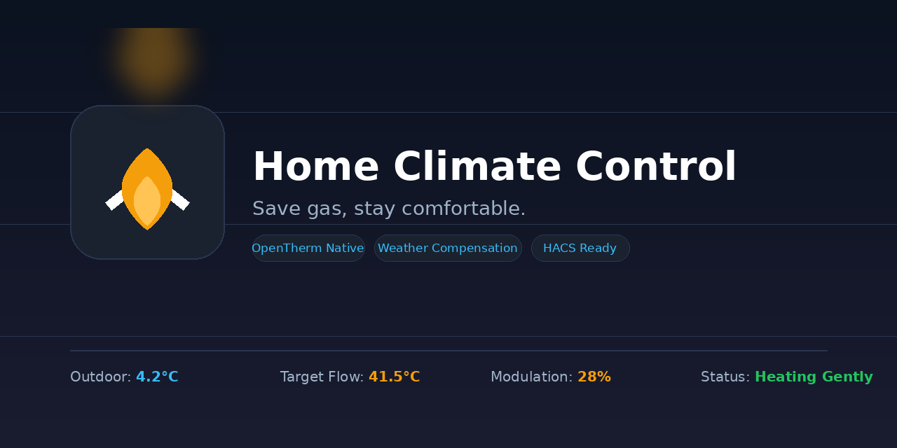

  

# Home Climate Control

**Multi-zone heating control for Home Assistant** — weather-compensated,
OpenTherm-native, and gentle on your gas bill.

Companion hardware + firmware: **[home-climate-system](https://github.com/ALeXXBody/home-climate-system)**
(ESP32/ESP8266 speaks OpenTherm to the boiler directly — no extra gateway box needed).

| | |
|---|---|
| **Repo** | https://github.com/ALeXXBody/home-climate-control |
| **Domain** | `home_climate_control` |
| **License** | MIT |

## Naming

| Name | What it is |
|---|---|
| **Home Climate Control** | This software — Home Assistant custom integration |
| **Home Climate System** | Hardware + ESP32/ESP8266 firmware (separate repo) |

## Highlights (v1.0.0)

- **Multi-zone climate entities** — presets, window-open pause, TRV demand respect
- **Weather-compensated controller** — heating curve + PID flow boost, lowest workable flow temperature
- **OpenTherm gateway mode** with role auto-detect (master-only ⇄ gateway)
- **Boiler diagnostics in plain language** — fault flags decoded, shown in HA and the sidebar panel
- **Boiler identity** — manufacturer auto-detected from the MemberID; make/model dropdown with picture on the Overview page
- **1-Wire sensor support** — DS18B20 probes for outdoor / return water backfill
- **Connection-loss failsafe** — configurable keep-warm behaviour when WiFi/MQTT die
- **Firmware manager** — auto-update discovery from GitHub releases with changelog and one-click "Update all"
- **Sidebar panel** — Overview · Zones · Floor plan · Firmware · Settings

## Tested hardware

| Component | Model |
|---|---|
| Boiler | **Viessmann Vitodens 100-W B1KF** (MemberID 33, radio module variant) |
| OpenTherm shields | DIYLess Master OT (+ Slave OT for gateway bench) |
| Controllers | LOLIN C3 mini v2.1 (direct shield fitment), ESP8266 D1 mini, LOLIN S2 mini |

> The B1KF does not report return-water temperature — assign a DS18B20 probe
> the `return` role in the device's Sensors tab and HCC fills the gap.

## Requirements

- Home Assistant 2024.1 or newer
- [HACS](https://hacs.xyz/)
- MQTT integration configured in Home Assistant
- An OpenTherm source:
  - a **Home Climate System** device (`*_gw` firmware builds), or
  - an OTGW-firmware gateway publishing to MQTT

## Install via HACS

1. HACS → ⋮ menu → **Custom repositories**
2. Repository: `https://github.com/ALeXXBody/home-climate-control`, Category: `Integration`
3. **Add**, then download **Home Climate Control** from HACS → Integrations
4. Restart Home Assistant
5. Settings → Devices & services → **Add integration** → *Home Climate Control*
   - Backend: HCS device or OTGW-firmware MQTT (a **Demo** backend is included for testing without hardware)
   - Configure zones (name, room sensor, optional TRVs/window sensors)

## Sidebar panel

After setup, a **Home Climate** item appears in the sidebar:

| Tab | What you get |
|---|---|
| **Overview** | Outdoor/flow/demand cards, zone summary, boiler picture with make & model |
| **Zones** | Per-zone temperature, heat/off, presets |
| **Floor plan** | Placeholder (coming later) |
| **Firmware** | Discovered devices, update banner with changelog, per-device flash + "Update all outdated" |
| **Settings** | Failsafe values pushed to devices, boiler make/model selection |

## Manual install

Copy `custom_components/home_climate_control` into `config/custom_components/`
and restart Home Assistant.

## Update

HACS → Integrations → Home Climate Control → Update → restart HA.
The panel's Firmware tab will tell you when device firmware updates are available too.

## Docs

- [Architecture](docs/architecture.md)
- [Logo / branding](docs/branding/)

## Support

If this project helps you, support development here:

## License

MIT (see [`LICENSE`](LICENSE)).
